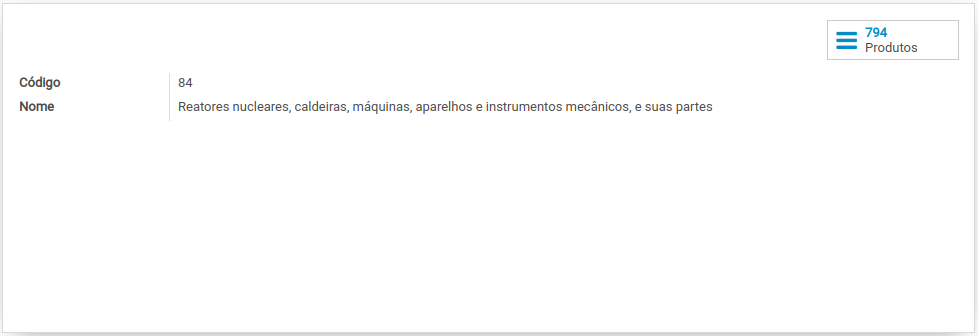

# Gênero de Produto

## O que é o Gênero de Produto?

## Lista dos Gêneros de Produtos

| Código | Descrição |
| :--- | :--- |
| 00 | Serviço |
| 01 | Animais vivos |
| 02 | Carnes e miudezas, comestíveis |
| 03 | Peixes e crustáceos, moluscos e os outros invertebrados aquáticos |
|  |  |

## O Gêneros de Produtos no Odoo


_**Fiscal &gt; Configuração &gt; Produtos &gt; Gênero de Produto**_


A importação de gênero de produtos é preechida automáticamente no cadastro de [produto](../../produtos-e-servicos/produto.md) quando é alterado o campo do [NCM](ncm.md)

