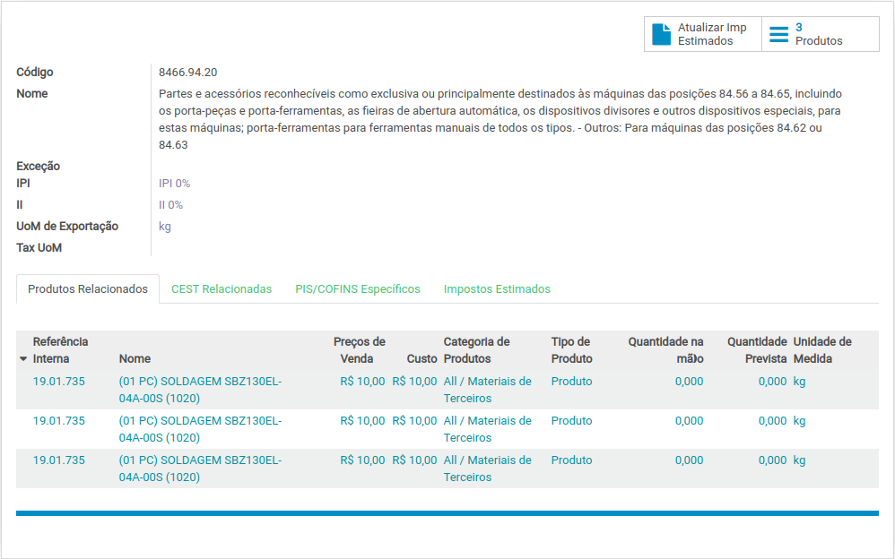

# NCM

## O que é NCM?

A Nomenclatura Comum do Mercosul \(NCM\) é uma Nomenclatura regional para categorização de mercadorias adotada pelo Brasil, Argentina, Paraguai e Uruguai desde 1995, sendo utilizada em todas as operações de comércio exterior dos países do Mercosul. 

A NCM toma por base o Sistema Harmonizado \(SH\), que é uma expressão condensada de “Sistema Harmonizado de Designação e de Codificação de Mercadorias” mantido pela Organização Mundial das Alfândegas \(OMA\), que foi criado para melhorar e facilitar o comércio internacional e seu controle estatístico.

## O NCM no Odoo


_**Fiscal &gt; Configuração &gt; Produtos &gt; NCM**_


O Cadastro de NCM é carregado e mantido atualizado, este cadastro unifica as informações de:

* [TIPI](ncm.md#tipi);
* [Imposto de Importação](ncm.md#imposto-de-importacao);
* [Unidades de Medidas Tributáveis no Comercio Exterior](ncm.md#unidades-de-medidas-tributaveis-no-comercio-exterior);
* [Impostos Estimados](ncm.md#impostos-estimados);

### TIPI

Tabela de Incidência do IPI \(TIPI\) é a Nomenclatura Comum do Mercosul \(NCM\) acrescida das alíquotas do IPI e dos Ex tarifários da TIPI. A TIPI que tem por base a NCM passou a vigorar em 1º de janeiro de 1997 por força do Decreto nº 2.092/1996.

### Imposto de Importação

bla bla bla.

### Unidades de Medidas Tributáveis no Comercio Exterior

bla bla bla.

### Impostos Estimados

Impostos Estimados.

## 

