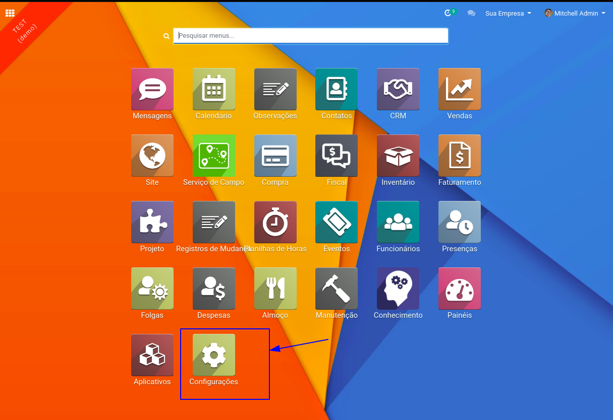
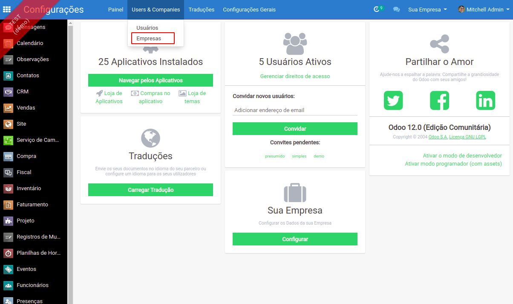
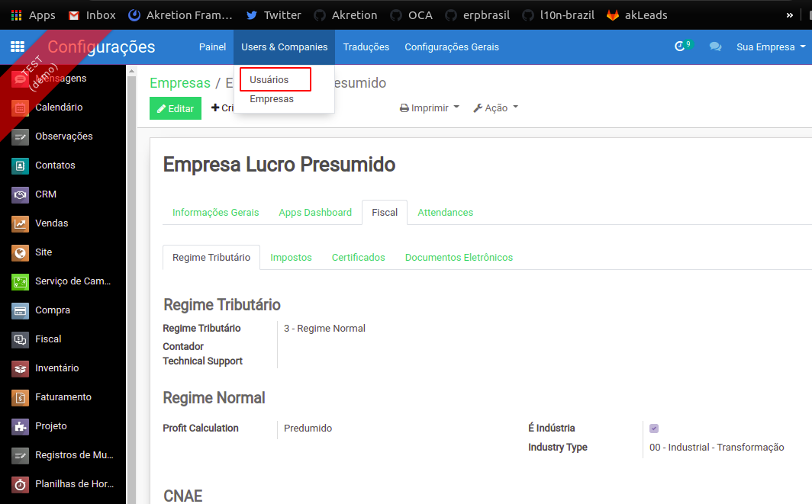
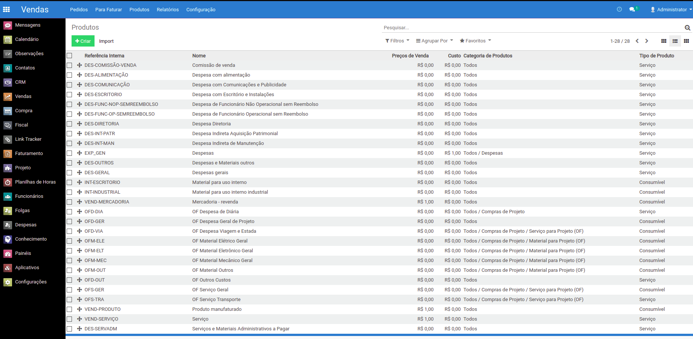
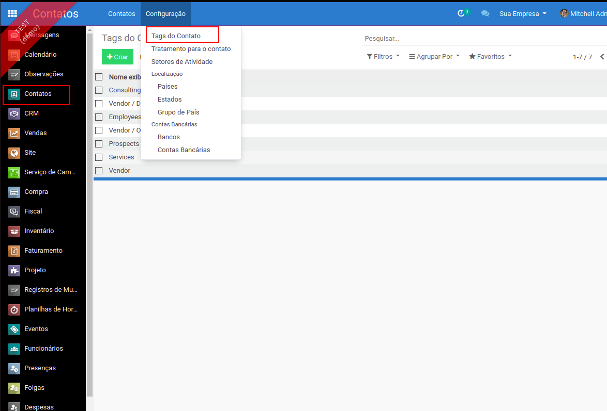
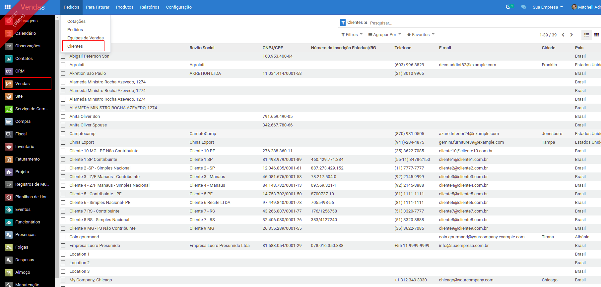
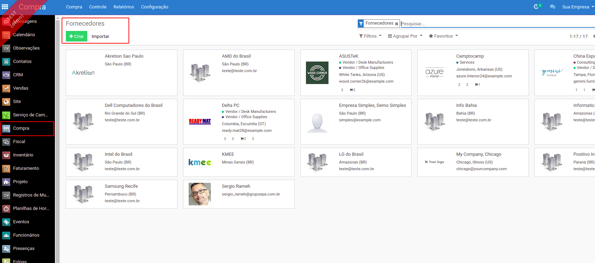
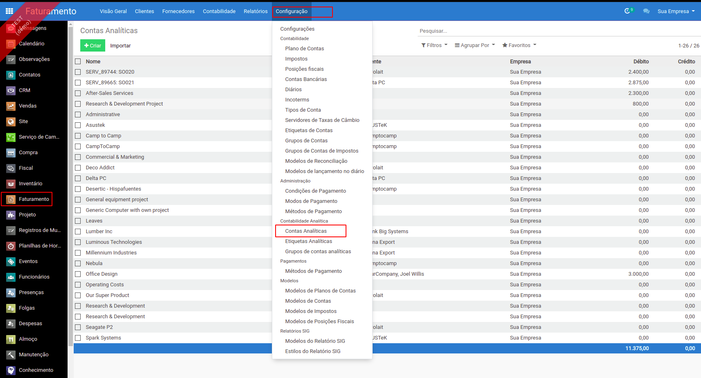
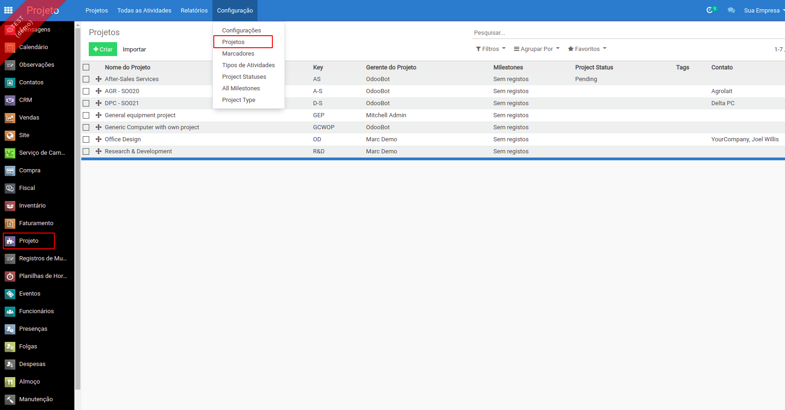
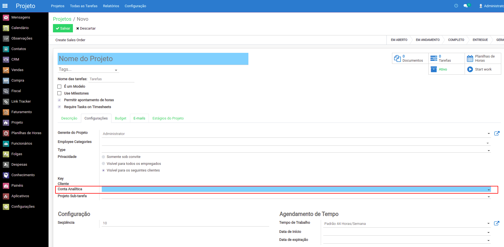

# Cadastrar dados básicos

## **Documentação introdutiva básica do Odoo**

A documentação do Odoo pode abordar alguns temas avançados, mas esses links ensinam coisas básicas que são fáceis de testar com um banco de demo é são bons exemplos para se familiarizar com a navegação e as telas do Odoo antes de partir para cadastrar os dados reais da empresa.







## **Documentação sobre importação de cadastros**

De acordo com cada projeto, alguns cadastros podem ser digitados manualmente como os cadastros de empresa ou de operações fiscais. E para alguns outros cadastros pode ser interessante de importar dados de outros sistemas. Seguem aqui tutoriais básicos para importar clientes e fornecedores, projetos e produtos. Os conceitos são genéricos e podem servir para importar e exportar qualquer cadastro:

[https://odoo-doc.gitbook.io/import/v/pt/](https://odoo-doc.gitbook.io/import/v/pt/)

[https://odoo-doc.gitbook.io/import/v/pt/importar-contatos](https://odoo-doc.gitbook.io/import/v/pt/importar-contatos)

[https://odoo-doc.gitbook.io/import/v/pt/importar-projetos](https://odoo-doc.gitbook.io/import/v/pt/importar-projetos)

[https://odoo-doc.gitbook.io/import/v/pt/importar-produtos](https://odoo-doc.gitbook.io/import/v/pt/importar-produtos)

## **Passo a passo dos cadastros iniciais**

### **Empresas**

### **Usuários**

Em especial, você pode atribuir empresas e grupos de acesso para cada usuário.

### **Funcionários** 

###  **Prestar atenção a preencher os usuários relacionados:**

### **Categoria de produtos**

Se trata na verdade de uma categoria principal de produtos, aquela que é mais importante para diferenciar os macro-tipos contábeis de produtos \(por exemplo despesa ou serviço de consultoria\). Pode ser hierárquica. \(Existe também um sistema de tags categorizar os produtos além de forma transversal se for preciso\)

### **Unidades de medidas**

Verificar se está tudo OK, especialmente as unidade de tempo usadas:

### **Produtos**

Vale a pena a reflexão de ate onde detalhar ou não os produtos. Por exemplo uma empresa de engenharia pode começar a operar o Odoo com um produto genérico como material eléctrico e só depois passar a gerenciar os produtos exatos. Aconselhamos essa forma progressiva de funcionar para não enfrentar todas dificuldades de uma vez. Exemplo de produtos para uma empresa de engenharia:

### **Tags dos contatos**

Chamado também de "_Marcador de Contato_" ou "_Categoria de Contato_" Serve para categorizar fornecedores e clientes

### **Fornecedores**

É importante entender que no Odoo, clientes, fornecedores, contatos e endereços vão todos na mesma tabela res\_partners são apenas alguns campos e flag vão diferenciar esses cadastros ou relacionar eles \(por exemplo, um cliente pode ter vários endereços\). Porem de acordo com o menu que você usa para acessar ao cadastro, o registro já vem os flags de fornecedor ou de cliente.

Para esses cadastros pode valer a pena ler a documentação anterior sobre como importar arquivos .CSV ou .xls em vez de digitar tudo manualmente.

### **Clientes**

### **Contas analíticas dos projetos \(centros de custo\)**

Para ter uma gestão por centro de custo, é essencial você preencher uma estrutura de contas analíticas onde cada projeto terá no minimo uma conta analítica. Alem disso, é aconselhável você parametrizar uma conta analítica mãe guarda chuva para cada cliente ou você pode ate ter uma hierarquia mais fina com sub-projetos e sub-contas analíticas. O importante é ter uma estrutura rigorosa e sistemática para poder analisar os projetos depois.

### **Projetos**

Depois você pode relacionar um projeto a uma conta analítica para ter certeza que vai conseguir analisar as despesas e receitas do projeto:

### **Armazéns e locais?**

Aconselhamos começar apenas com um so armazém e local dentro do armazém. Mas se isso não for possível, temos que conversar sobre para tomar as decisões certas.

## **Documentação complementar**

[https://www.odoo.com/documentation/user/12.0/expense/expense.html](https://www.odoo.com/documentation/user/12.0/expense/expense.html)

[https://www.odoo.com/documentation/user/12.0/accounting.html](https://www.odoo.com/documentation/user/12.0/accounting.html)

[https://www.odoo.com/documentation/user/12.0/inventory.html](https://www.odoo.com/documentation/user/12.0/inventory.html)  
****

## **Sistemas de relatório**

[https://github.com/OCA/reporting-engine/tree/12.0/bi\_sql\_editor](https://github.com/OCA/reporting-engine/tree/12.0/bi_sql_editor)

[https://github.com/OCA/mis-builder/tree/**12.0**](https://github.com/OCA/mis-builder/tree/12.0)

 Odoo Experience 2017 \([slides](https://www.slideshare.net/acsone/budget-control-with-misbuilder-3-2017), [video](https://youtu.be/0PpxGAf2l-0)\)  
  
****

