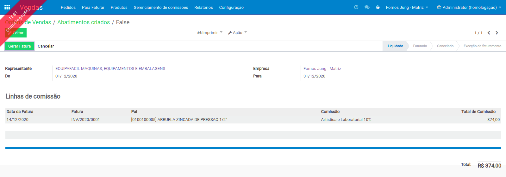

# Comissões de Venda

Para gerenciar as comissões dos representantes/agentes de vendas no Odoo é necessário instalar os módulos contido no repositório [OCA/Commission](https://github.com/OCA/commission), no repositório temos os seguintes módulos:

* hr\_commission;
* sale\_commission;
* sale\_commission\_formula;
* sale\_commission\_pricelist;
* sale\_commission\_salesman.


Para gerenciar as comissões é necessário instalar apenas o módulo _sale\_commission_ os outros módulos implementa funcionalidades adicionais que devem ser instalado de acordo com a necessidade.


### Configurações

sfsdfsfdsd

### Comissões

sfsdfsdfsdfsdfsd

### Representante/Agente Comercial

sfsfsdfsdfd

sdfsfsdfsdfd

### Parceiros \(Clientes\)

sfsfsdfsdfd

### Pedido de Venda

sfsfsdfsdfd

gsdgsdgsdf

### Gerando Comissões

sfsfsdfsdfd

sfghghdfhdfgh

dfghdfhdfhdfgh

sdfgsdgsdgsdgsdfgsdfg

### Gerando Contas a Pagar de Comissões

sfsfsdfsdfd

hdshdfhfsdgh

