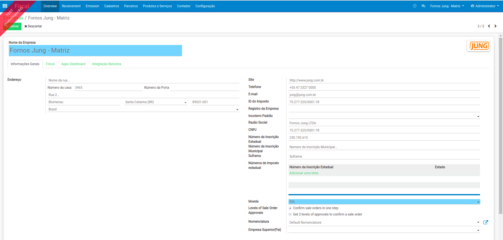
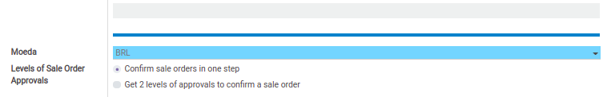
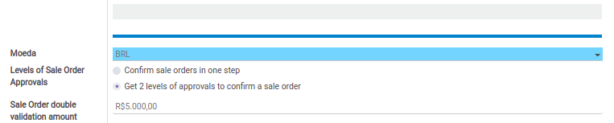

# Validação Dupla

É possível configurar uma aprovação dupla na confirmação dos pedidos de venda, para configurar essa funcionalidade é necessário instalar o módulo [sale\_double\_validation](https://github.com/OCA/sale-workflow/blob/12.0/sale_double_validation).

Para modificar a configuração de validação no pedido de venda, é necessário editar o cadastro de empresa.

Abaixo do campo de Moeda, existe um campo com duas opções para definir a validação do pedido de vendas:

1. Confirmar o pedido de venda em um passo;
2. Definir dois niveis de aprovação para confirmar um pedido de venda.

### Confirmação do Pedido de Venda em um Passo

É a opção nativa do Odoo, onde existe apenas um nível de confirmação para transformar a cotação de venda em pedido de venda.

### Definir dois níveis de aprovação para confirmar um pedido de venda

Antes de transformar uma cotação de venda em pedido de venda é adicionado um status para segunda aprovação antes de transformar a cotação de venda em pedido de venda.

Também é possível definir um valor do cotação de venda que exige uma segunda validação, ou seja qualquer cotação de venda que esteja abaixo deste valor não terá o segundo nível de aprovação e todas as cotações de venda com valor superior será exigido a segunda aprovação.


Para exigir que todas as cotações tenham dois níveis de aprovação o campo: "Valor da Cotação de Venda" deve estar definido como R$ 0.00.


